### Applying RL to Cart Pole Balancing Problem

Built and trained a PPO based reinforcement learning agent to solve the CartPole control task. The agent learns through trial and error interactions with its environment, gradually improving its decision making from reward feedback

### Trained agent

### Mean episode length
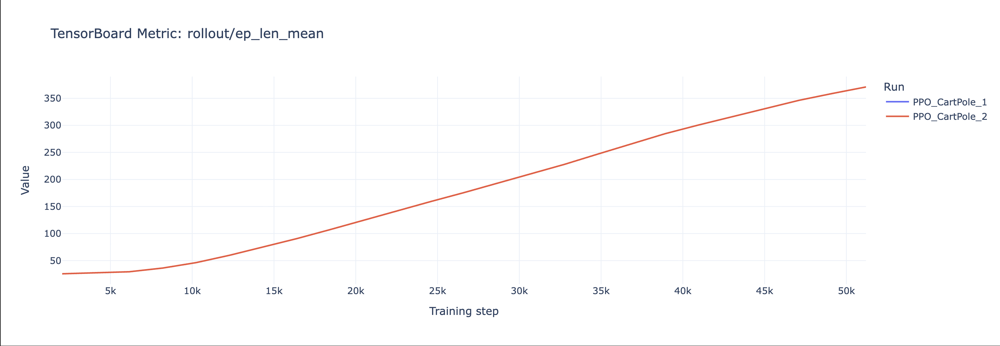

### Mean episode reward
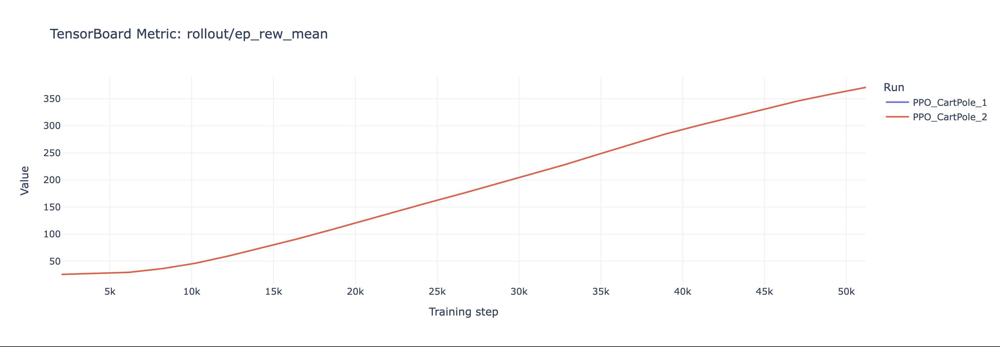 

### Training speed/fps
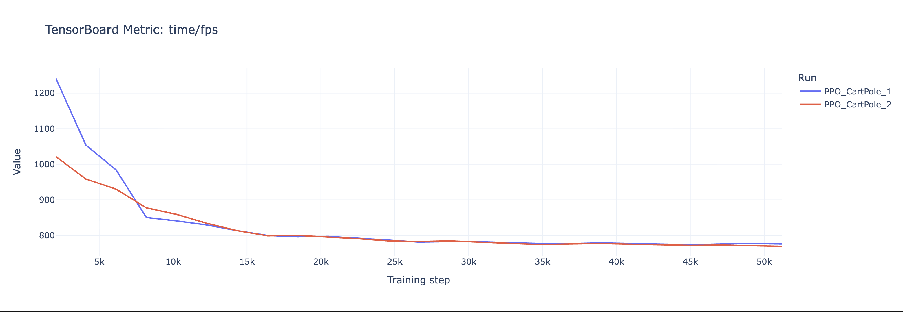

### Approximate KL Divergence
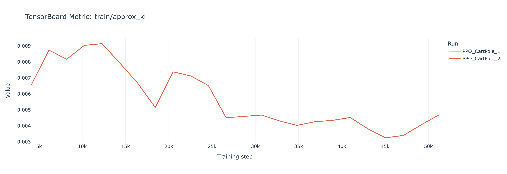

### Clip Fraction
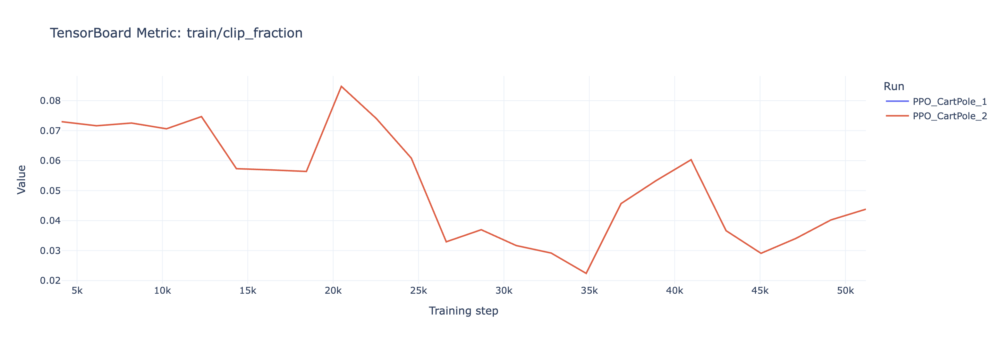

### Clip range
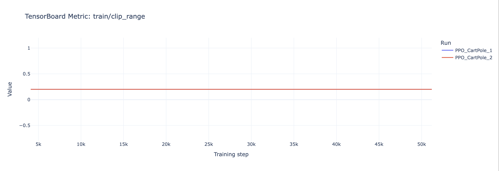 

### Entropy loss
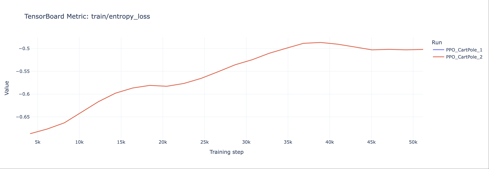 

### Explained variance
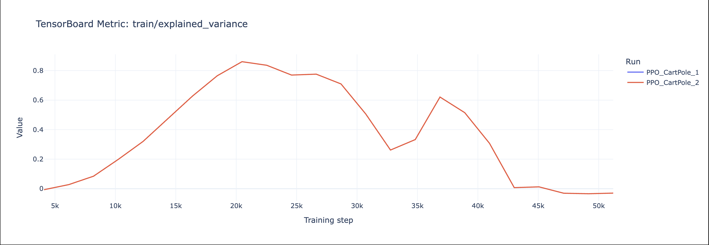 

### Learning rate
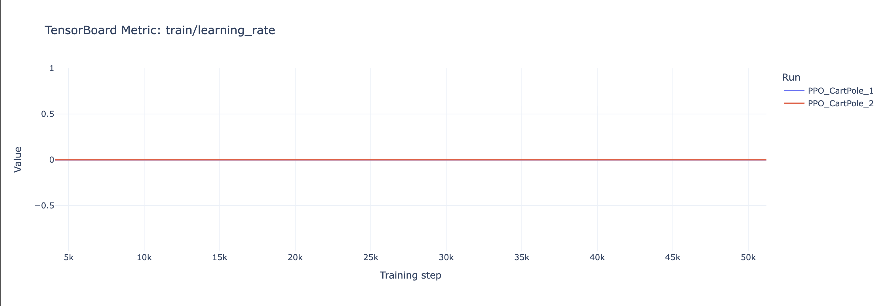 

### Loss
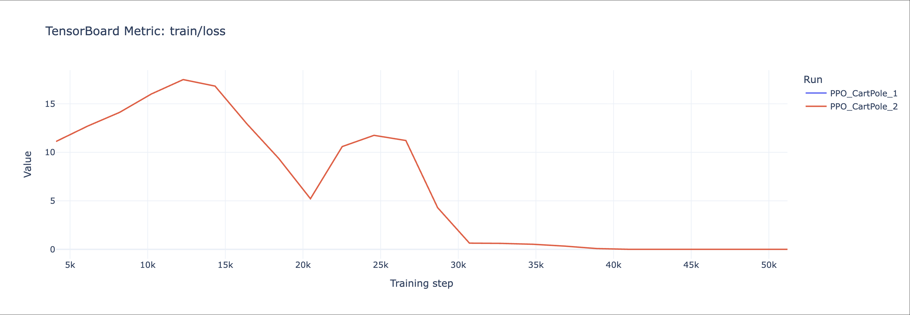 

### Policy gradient loss
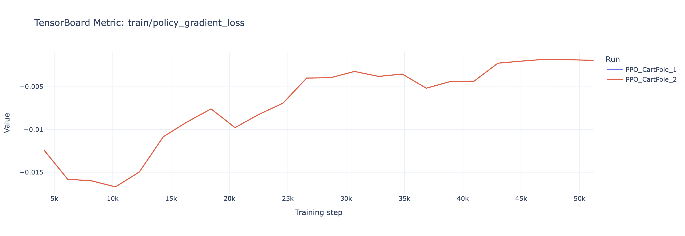

### Value loss
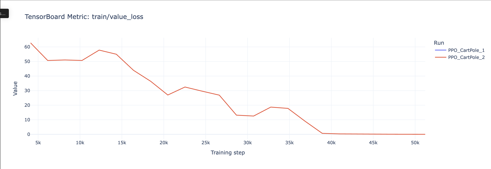
