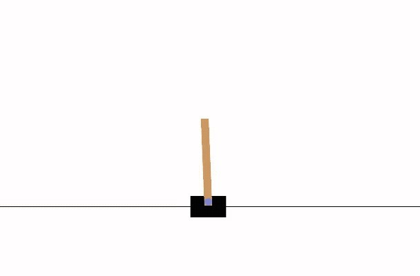

### Applying RL to Cart Pole Balancing Problem

Built and trained a PPO based reinforcement learning agent to solve the CartPole control task. The agent learns through trial and error interactions with its environment, gradually improving its decision making from reward feedback

